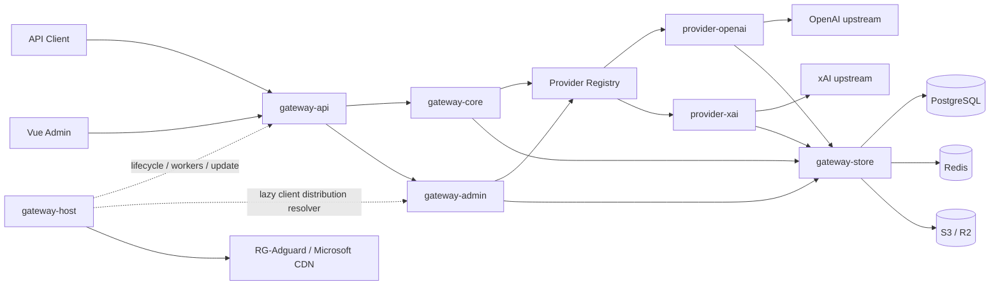
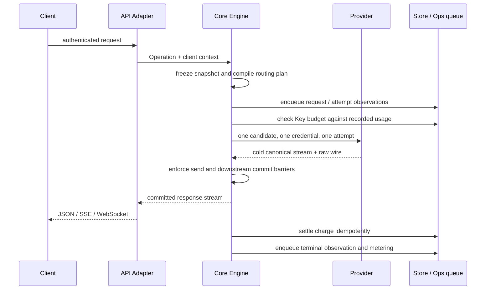

# Codex Proxy RS 架构

本文说明模块职责、请求流程、状态存储和必须保持的约束。
具体 HTTP 字段见 [接口文档](api.md)，部署参数见 [部署文档](../deploy/README.md)；上游 URL、超时、
重试间隔和 UI 布局属于源码或配置，不在架构文档重复维护。

## 1. 系统定位

Codex Proxy RS 是单进程、单副本运行的多 Provider AI 网关，同时提供：

- 面向客户端的 OpenAI Responses、Images、standalone Search 和模型目录协议；
- 面向管理员的 `/api/admin/*` 控制面和 Vue 管理端；
- OpenAI 与 xAI 两个编译期 Provider；
- PostgreSQL 持久化、Redis 协调状态以及 S3/R2 数据库备份。

系统不提供 `/v1/chat/completions`，不存在 Provider Instance 层，也不支持通过复制应用容器进行多副本
扩容。Client Key 限定账号分组，而不是绑定某个 Provider；一次请求的 Provider 候选由账号范围、模型
能力和运行时健康共同决定。

## 2. 运行拓扑



`backend/apps/gateway` 是唯一组合根，按 Host → Store → Provider → Core → Admin → API → Worker 的顺序
初始化具体实现。其余 crate 只暴露自己的配置、端口和 Bundle，不自行定位别的实现。

## 3. Workspace 边界

| 路径 | 责任 |
| --- | --- |
| `backend/apps/gateway` | 读取顶层配置、连接 Bundle、注册 Provider 与 Worker |
| `gateway-protocol` | 跨层共享的 OpenAI wire contract、SSE 编解码与无业务 owner 的解析事实，不依赖其他 workspace crate |
| `gateway-core` | operation、canonical event、请求快照、路由、admission、attempt 协调、交付边界和计量 |
| `gateway-admin` | 管理领域、用例、Provider/Store 端口、审计语义和备份策略 |
| `gateway-api` | HTTP/WS/SSE 解码与交付、Admin wire、静态管理端；不直接访问 Store 或具体 Provider |
| `gateway-store` | PostgreSQL、Redis、S3/R2、`pg_dump` 适配器；不拥有业务策略 |
| `gateway-host` | 配置加载、日志、HTTP 生命周期、Worker 监督和系统更新 |
| `providers/openai` | OpenAI OAuth、账号选择、目录、额度、Responses/Images/Search transport |
| `providers/xai` | xAI OAuth session、账号选择、目录、额度和 Grok/Responses 转换 |
| `frontend` | Vue 管理端，仅通过 Admin API 读写状态 |

依赖方向遵守四条规则：

1. Core 不依赖 HTTP、数据库、Redis 或具体 Provider。
2. Provider 之间不互相依赖，也不决定跨 Provider fallback。
3. API 只调用 Core/Admin 抽象；Store 只实现端口。
4. 具体实现只在组合根相遇。

组合根的 workspace architecture tests 冻结成员清单、依赖 DAG、公开模块面、源码纪律以及生产/测试模块
镜像关系；具体行为边界由各 crate 的集成测试维护。

### 3.1 Rust 模块组织约定

后端采用目录模块的 `mod.rs` 风格；以下规则由组合根的 workspace architecture tests 扫描全部生产源码与
测试模块树：

1. crate root 作为顶层门面，声明模块并暴露该 crate 的配置、Bundle、端口或稳定领域合同；目录节点使用
   `目录/mod.rs`，叶子模块使用 `名称.rs`，不混用 `名称.rs` 与 `名称/` 两套入口。
2. 生产源码不使用内联 `mod name { ... }`、`#[path]` 或 `include!` 隐藏文件归属。`lib.rs` 和各级
   `mod.rs` 是模块门面，负责声明子模块、选择性 re-export 与少量同层协调。
3. 子模块默认私有；只有真实的跨 crate 生产合同才能使用 `pub`。adapter/provider 的公开根模块由
   allowlist 冻结，变更必须同步完成边界审计，不能为测试或兼容路径创建第二 owner。
4. owner 级依赖保持单向。两个模块互相引用时，应把共享值对象、端口或生命周期能力提升到共同 owner，
   不能依靠同一 crate 内可见性掩盖循环边界。
5. 每个 crate 的 `src/` 与 `tests/` 平级，生产源码不承载测试。`tests/` 镜像 `src/` 的模块目录形态：例如
   `src/foo/mod.rs` 对应 `tests/foo/mod.rs`，`src/foo/bar.rs` 对应 `tests/foo/bar.rs`。一个生产模块可以没有
   测试；额外场景测试必须放在最近的生产 owner 目录下。根级 `support` 和冻结的 crate/workspace 架构场景
   是明确例外。

较大的模块门面只负责组合和 re-export：账号 Admin HTTP 边界按 `wire`、`credentials`、`handlers`、
`presenter` 划分；Provider 执行按 continuation、stream、failure、observation 和 worker 等职责拆分；xAI
请求转换按 response、tools 与 history 拆分。各子模块之间只使用 owner 内最小可见性。

### 3.2 `gateway-core` 内部 owner

`gateway-core` 内共享事实按语义 owner 划分，不再借用 `engine` 作为通用命名空间：

| 模块 | 唯一责任 |
| --- | --- |
| `policy` | Client Key 与客户端策略值对象，包括 cyber 会话屏蔽的匹配合同；不依赖 Provider、HTTP 或存储 |
| `validation` | 纯值对象校验错误和文本约束，不依赖事件、执行错误或路由 |
| `identity` | Provider 身份值 `ProviderKind`，只依赖纯校验 |
| `account` | Provider 账号/credential/quota 值对象、持久化端口与请求级账号选择；`scope` 持有分组、账号目录和冻结账号范围 |
| `metering` | 标准化 Usage、金额、费用估算与费用明细；不表示账号或开票系统 |
| `upstream` | 跨 Engine、Event、Error 与 Provider 共用的 transport 名称、发送状态和不透明上游值 |
| `lifecycle` | 取消信号、连接注册与 drain 合同 |
| `engine` | attempt、发送/提交屏障、执行编排和持久化调用时序 |
| `routing` | 冻结路由事实、请求计划、Provider 只读目录合同以及运行时快照的表示与编译 |
| `runtime` | 当前快照的发布、读取、revision 订阅与周期对账任务 |

`event` 通过 `validation` / `upstream` 使用基础值，不再依赖承载原始事件的执行错误；账号值对象和
选择策略通过 `identity` / `account::scope` 使用身份与范围，不依赖路由计划。`routing` 和 `error` 的
既有公开类型路径保留 re-export，定义与 Core 内部使用均归属上述 owner。架构测试约束这些叶子依赖。

Provider 模型能力、目录代次与 `ProviderCatalogPort` 由 `routing::catalog` 定义。快照编译和对账只消费
该只读合同，不反向依赖执行注册表；现有 `ProviderRegistry` 直接实现目录端口，仍只维护一份 Provider
注册集合。已知空目录与查询失败的未知目录保持不同语义，目录替身无需实现请求执行。

`engine::observation` 统一维护单次响应的用量、费用、时间和响应 ID，并负责重试前清理；协调器继续
独占发送、提交、重试和终结顺序。Provider 上报费用优先于本地估算，丢弃的 attempt 不得污染最终计量。
Client Key 费用账本独立累计各次 attempt 的实际费用，不能因请求重试而清空已产生的费用或未知计费状态。

## 4. 数据面请求生命周期



请求开始时冻结 `RuntimeSnapshot`、Client Key 的账号范围、模型映射、Codex 客户端最低版本、Provider
候选顺序和调度策略。
运行中的请求不再拼接新旧配置，也不在热路径查询分组关系。

OpenAI 环境与设备 metadata 覆盖由 OpenAI Provider 持有的 `RuntimeSettings` 运行策略负责，不改变 Core 的
请求历史或路由事实。每个上游 attempt 在账号选择和发送前一次性冻结覆盖策略与该次 UTC 时间；
该 attempt 的 HTTP、WebSocket 及 Provider 内部重试复用同一份已编码正文。Core 新建下一次 attempt
时可以读取已经发布的新策略。

Client Key 鉴权完成后，API adapter 从有界请求头识别 Codex Desktop/CLI，Core 使用同一请求冻结的
`RuntimeSnapshot` 比较对应最低版本。Desktop 优先于其 User-Agent 内嵌的 CLI/Core 标记；未知客户端不
应用门禁。低版本或已识别但版本不可用时，在进入 Provider 前返回稳定的 `426` 合同。

核心不变量：

- 一个客户端请求对应一条 `model_requests`；attempt 是请求内事实，不建立第二张权威表。
- Provider 的一次 `execute` 只选择一个 credential 并返回一个冷流；换号、重试和 fallback 由 Core 决定。
- `not_sent`、`sent`、`ambiguous` 是单调的上游发送边界；结果不明确时不能假定上游未收到请求。
- downstream commit 是不可撤回的交付承诺。commit 后禁止换号、重试和 fallback。
- 跨 Provider 只在账号范围和能力都允许，且请求尚未到达上游或已被证明可安全重放时发生。
- 可恢复观测写入失败不能替换已经确定的客户端协议结果。

Responses 按模型目录编译候选；全局模型映射是精确映射，未命中时模型名原样交给候选 Provider。
Images 与 standalone Search 是 OpenAI Provider 自有端点：两者都不参与文本模型映射，只在 Client Key
的账号范围确实包含 OpenAI 账号时生成单一 OpenAI 候选。Images 不要求模型字段；Search body 中的模型
及其他未涉及字段和顺序保持不变并由上游解释；启用环境与设备 metadata 覆盖时，只有下述位置和 metadata
字段例外更新。

## 5. Provider 与协议边界

Core 只理解 `Operation`、能力要求、Provider 候选、稳定错误和 canonical event，不读取 Provider SDK
类型。Provider 独占 credential schema、OAuth、账号选择、模型目录、额度投影和上游 transport。

- OpenAI 在环境与设备 metadata 覆盖关闭时保持透明边界。Responses 在解析后的请求结构中保留未知字段、字段值和顺序，
  但不承诺输入 JSON 的空白与转义字节；standalone Search 请求按原始字节转发。Images 始终按原始字节转发。
  HTTP SSE 与 WebSocket 的上游业务事件也按原始字节转发。canonical facts 仍从同一数据旁路提取，只用于
  路由、观测和计费。
- Responses 的业务扩展头保留原始多值字节；传输与反代请求头分类由 `gateway-protocol` 统一定义，
  API 入站与 OpenAI Provider 编码共同使用。下游链路元数据和压缩协商不跨越该边界，
  上游认证、请求画像与传输字段仍由 Provider 生成；响应方向的诊断头不受请求过滤规则影响。
- 覆盖启用后，Responses HTTP 与 WebSocket 只更新最新的专用 Codex `input_text` 环境块（整个
  XML 根为 `environment_context`，且直接存在时区和日期字段）。日期使用该上游 attempt 单次捕获的 UTC
  时间，按配置的 IANA 时区（含夏令时）换算；引用文本、工具输出、其他历史消息及其他环境块不改写；没有
  符合条件的环境块时不注入，也不通过 `previous_response_id` 补写历史。standalone Search 的
  `settings.user_location` 与 Responses 中已声明且受支持的 `web_search` location 对象使用
  `type: "approximate"`、配置的国家和时区，删除冲突的 `city` / `region` 并保留其他字段；不会添加
  搜索工具。standalone Search 缺失或为 `null` 的 `settings`、`user_location` 会创建所需对象，已有
  字段不是对象时保持不变。地域覆盖只改变请求 body，不伪造国家请求头、数据驻留、出口 IP 或操作系统
  设置。覆盖关闭或目标字段没有变化时，standalone Search 整份正文保持原始 bytes；Responses 保留解析后的
  请求结构，但不承诺输入 JSON 的空白与转义字节。覆盖生效并产生变化时，其他字段及顺序保持不变。
  同一运行策略在账号 lease 选定后的 OpenAI request scoping 边界清理有限设备 metadata：仅匹配
  `client_metadata` 的直接键，以及明确 turn-metadata 容器中的精确设备键；HTTP header、WebSocket body
  投影和 standalone Search 共用同一规则。该逻辑不递归扫描 `input`、`instructions`、`tools`、输出、opaque
  或 encrypted 内容，也不建立业务 metadata 白名单。账号身份、installation ID 和账号绑定状态仍由原有
  scoping 规则独立处理，关闭覆盖不能绕过这些安全边界。精确字段与兼容行为由接口文档维护。
- xAI 是翻译边界。Provider 把 Grok wire 转换为 Responses wire；上游结构化错误的 message/code/type
  可以透出，但账号指纹会先脱敏。
- response ID 是不透明 UTF-8 bytes，不假设 UUID、固定长度或跨 Provider 可复用。
- 请求画像以配置为启动基线。Dashboard 分别展示启动平台基线、最终有效 User-Agent 及其来源，不从任意
  User-Agent 字符串反推操作系统。OpenAI Desktop 与 xAI CLI 的官方版本检查只更新各自负责的运行时画像，
  不回写 `config.yaml`。

### Cyber 会话屏蔽

Core 的 `policy` 在 `RuntimeSnapshot` 和每个请求计划中冻结 cyber 屏蔽开关与 TTL，并按
`Client Key + 语义会话`执行匹配。会话身份优先取经校验的显式 ID；缺失时才从完整历史计算精确
前缀/续接。匹配键不包含账号、模型或通道；只读取用于匹配的结构化会话/历史字段，不保存请求正文。

Provider 先读取顶层 `error.code`；该值缺失或去除首尾空白后为空时，才回退读取 `response.error.code`。
顶层值非空时不读取嵌套值；比较前去除首尾空白并按大小写不敏感匹配，规范化后精确等于
`cyber_policy` 才把它作为拒绝事实交给 Core，不以 `message` 或正文文本扫描代替结构化判断。
Core 决定本地 403 与后续调度；Store 的 Redis 适配器只保存可过期的 session marker，不新增永久屏蔽表
或正文归档。首次写入确定 TTL，后续写入及本地重试不续期；配置编辑不改变已存条目的剩余 TTL。开关关闭时忽略
现有条目，命中且启用时在上游之前拒绝；HTTP/SSE 以请求为单位，Responses WebSocket 以每个
`response.create` turn 为单位。

### 账号出站代理

出站代理属于账号配置，由各 Provider 在推理、OAuth 服务端交换/刷新、额度、目录和资料等请求中统一使用。
指定代理不可用时请求失败，不退回直连；未配置时直连，不继承进程的全局代理环境变量，TLS 仍验证证书。
用户浏览器访问第三方授权页时的出口不受网关设置控制。

连接池按出口隔离。修改代理推进配置 revision，使后续请求使用新出口；已执行请求可沿原连接完成。
代理变更不推进 `credential_revision`，不会使进行中的令牌刷新因凭据版本冲突而丢失结果。
xAI 的推理连接池继续按账号绑定隔离；OAuth、目录/计费辅助请求在各自 transport 内复用有界出口
client，OIDC 的 JWKS 缓存与单飞归属对应出口状态。自动刷新提交凭据后的目录预热重新读取当前账号
出口，不从 token-only 路径绕过代理；JWKS 过期或获取失败仍不使用 stale fallback。

代理独立保存和测试，通过 `outboundProxyId` 绑定账号；账号保留解析后的 URL 供 Provider 使用。
连接配置改变时在同一事务内同步关联账号并清除旧测试结果，已绑定的代理不可删除。
关联账号支持单独移除：在原子更新中校验当前代理 ID，只清除账号的代理 ID 和 URL，
保留账号其他设置；提交配置版本与审计后复用快照发布流程，使后续请求使用直连。
代理目录只携带关联数量；账号明细通过独立分页读端口按需查询，复用代理 ID 索引，
在同一个只读快照中统计并读取有界页面，不在目录中聚合完整账号数组。
文件及 AT/RT 导入在上游凭据交换前取得 PostgreSQL 会话级共享咨询锁，直到凭据提交后释放。
代理修改、删除和测试结果写入通过同一资源的事务级独占锁检查，导入期间直接返回冲突。
锁连接不占用提交所需的连接池槽位，也不持有空闲事务；每进程最多增加四个导入保护连接。
请求取消或进程退出时关闭会话并释放锁。探测器由组合根注入 OpenAI 的 HTTP 客户端构建函数，
复用其自定义 CA 加载与证书校验规则，Host 不依赖具体 Provider 包。
迁移 `0005_managed_outbound_proxies.sql` 将已有 URL 按完整连接信息合并为共享代理，保留认证及账号绑定。

导入器在认证交换前解析并校验账号出口。sub2api 的代理引用按完整 URL 登记为共享代理并绑定账号；
其 SOCKS5 配置按远端 DNS 语义转换为 SOCKS5H。账号导入只迁移账号及出口，不迁移下游 Key、余额或历史用量。
代理认证信息仅通过敏感账号导出返回，列表、详情、Debug 和普通审计不得暴露；数据库及备份按凭据保护。
输入字段、协议支持与导入校验见 [账号 API](api.md#5-账号)。

Managed proxies store names, credentials and connectivity results independently. Accounts bind by ID and retain
the resolved URL for provider transports. Connection edits update all bound accounts atomically and invalidate
old tests; in-use proxies cannot be deleted. Migration 0005 preserves existing credentials and account bindings.
Proxy changes advance the runtime configuration revision without invalidating in-flight token refreshes.

### Codex 原生生图与认证

管理端导出的 Codex 配置使用代理 Bearer 密钥，并声明服务端托管账号认证。
客户端据此开放原生生图工具，图片生成和编辑仍进入现有 Images 路由，不新增独立的登录或图片代理服务。
这只解决客户端能力识别；模型能力、客户端限制和上游账号的实际生图权限仍分别检查。

`X-OpenAI-Actor-Authorization` 是客户端能力标记，不是账号凭据。API 解码和 OpenAI Provider
都过滤该 header，网关继续校验 Client Key，上游认证由服务端账号产生。
仅含代理密钥的本地 `auth.json` 可以与新配置共存。配置示例维护在
[部署文档](../deploy/README.md#客户端配置)。

客户端到代理与代理到上游的传输选择相互独立。客户端的 `supports_websockets = false`
不禁止 Provider 使用上游 WebSocket。响应终态前的 Close 1000 仍视为失败，
后续恢复请求成功也不改写原失败请求的结果。

### 错误与诊断三层边界

错误信息按用途分成三层，不能用同一个 `message` 同时承担协议、界面和诊断职责：

1. **数据面协议错误**：`/v1/*` 继续遵守 OpenAI/xAI wire 合同。可交付原始上游响应时保留其状态、headers、
   content type 和 body；本地 fallback 使用数据面稳定机器码与安全英文，不受管理端中文化影响。
2. **控制面展示错误**：`/api/admin/*` 由 API 统一 HTTP 状态与数值业务码，由 Admin/API owner 提供安全中文
   文案。extractor rejection、namespace 404 和 method 405 也使用同一 JSON 信封；任意 Store、Serde、
   Provider `Display` 不得直接跨越 HTTP 边界。
3. **原始上游诊断**：只在连接测试、运维错误详情等明确诊断界面展示已经捕获的原始字段，不翻译、不补造，
   也不塞入普通 Admin 错误信封。原始 body 不进入 Debug、普通日志或持久化错误消息。

Provider 管理适配在仍持有结构化失败事实时选择静态 `public_message`；Admin 将其转为可安全展示的
`AdminError.message`，API 保留其中的 502／503 具体原因，无公开消息时才使用通用回退。认证与未知
内部异常仍保持固定文案，不能把任意 Provider／Store 的 message 直接放行。
管理提示与 Worker 的处置分类是不同职责：例如 OpenAI 刷新已收到 401 时，可以提示已解析的令牌
拒绝原因，但不因此改变现有有界恢复退避和账号终态判定。刷新繁忙、已知上游失败与结果未知分别映射为
409、50201、50202；结果未知不能触发自动重放一次性凭据，Vue 也不重新解析上游错误码或正文。

连接测试的 `gateway` / `provider` / `upstream` 来源以及 `not_sent` / `sent` / `ambiguous` 发送状态由 Core 在
仍持有完整执行错误时一次判定；Vue 只能根据稳定字段生成摘要，不能匹配英文错误句子反推来源。

## 6. 路由、账号范围与 continuation

Client Key 与账号分组形成授权范围：

- 没有分组关联表示 `AllAccounts`；
- 有关联时只允许已启用分组成员的并集；
- 已绑定分组为空或全部禁用时得到空池，绝不回退为全部账号；
- 分组可以包含多个 Provider，账号也可以属于多个分组。

账号选择综合启停状态、credential/quota 事实、Redis cooldown、并发上限、权重、请求间隔和会话亲和。
账号编辑在一个事务中替换完整调度事实。导入与首次 OAuth 可携带统一账号设置，由 Admin 传递给 Store，
与凭据在同一事务中提交；Provider 仍独占凭据解析。未附带设置的导入、重新授权和后台刷新保留已有分组、
权重与并发设置。管理端导入和账号编辑共用设置表单，凭据输入独立于设置。

Continuation 仍受原请求的 Client Key、账号范围、Provider 和发送/交付边界约束：

- native continuation 固定创建它的 Provider 与账号；
- OpenAI 按 native → replay owner → replay any 推进，并保留官方 `previous_response_id` 语义；
- xAI 使用客户端提交的完整历史作为重放输入；
- scope 外账号、跨 Key 复用或不明确发送结果均 fail closed。

会话亲和是优先选择提示，不是硬账号绑定；native continuation 才携带不可跨越的 owner 约束。

OpenAI 的实验性 Turn State 覆盖按账号保存在 PostgreSQL，默认关闭。Provider 在取得账号 lease、
完成账号身份及续接状态隔离后读取该账号的启用值，统一作用于本次 attempt 的 HTTP 和上游 WebSocket
出站编码；不更改 Redis native continuation pin 的保存和读取。真实上游 HTTP 响应头或 WebSocket
metadata 单独记录为该账号最近观测，不把手动出站值当成上游事实。观测写入尽力执行，失败不改变
客户端结果；管理端读取和覆盖修改经专用 Admin 端口，按账号版本及观测 ID 防并发覆盖。
服务启动时在接受请求前把最多 65536 个已有账号配置条目（含禁用 revision tombstone）hydrate 到
进程内账号快照；超限会阻止启动，不截断。管理事务提交后按账号 revision 单调更新快照，迟到的旧 revision
不能覆盖新值或禁用 tombstone。Provider 在每个 attempt 的最终账号边界只读一次快照，不执行 SQL；已经读到旧值的 attempt
继续使用该值，后续 attempt 使用新值。重启以 PostgreSQL 全量重建快照。

上游值在 HTTP headers、WebSocket 握手或每个 metadata 帧的实际接收边界生成 UUIDv7 与观测时间。
同一观测随后取得 response ID 时以相同观测 ID 补充关联；PostgreSQL 只接受时间/ID 更新的观测或同 ID
补充，旧长流的迟到写入不能覆盖新请求。WebSocket 的全量观测通道独立于 continuation 的首值通道，
连接复用仍在每轮清空连接级 metadata。WS 接收任务在解析每个归属明确的 metadata 时直接携带冻结的
request / attempt / account 入队，不等待 Provider stream 被下游继续 poll；用于响应投影的单次 exchange
缓存仍只保留最新 32 项，不参与请求末值或 `changed` 的正确性。数据面只向容量 512 的进程内队列执行
非阻塞入队；满载或关闭时
丢弃并记录不含原值的告警，Store daemon 串行写 PostgreSQL，关闭时最多排空 2 秒。

请求级 Turn State 另以模型请求 ID 和实际上游 attempt 序号保存每个 attempt 最后的原值；请求详情
只读取 `model_requests.attempt_count` 指向的最终 attempt，旧 attempt 和账号最近值不补缺失值。请求
创建/终态与账号观测由独立有界队列写入，所以请求级观测按归属键和接收时间/ID 合并，不依赖落库
顺序；当前请求行尚未落库的观测允许先保存，未关联成功的孤儿在保留清理中淘汰。请求创建时标记
采集代次，升级前历史行缺失值显示“未采集”，新请求缺失值显示“未观测”。仅已认证请求详情读取
明文与 hash，列表只读取长度和分类，汇总只聚合分类。请求级原值的有效期不超过
`usageRetentionDays`；过期请求先删除关联原值，再删除请求行，独立孤儿按原值时间清理。原有账号
最近观测与手动覆盖不变，不建立状态池或自动回放。

模型级 HTTP Turn State 锁另按 `账号 + identity_revision + effective model` 持久化；
`identity_revision` 只在上游身份实际替换时推进，普通 token refresh 不废弃同一身份的模型锁。服务启动
hydrate 模型锁到进程内快照，HTTP attempt 在最终账号与模型确定后只读该快照，不执行 SQL。有效值必须是
292 个可打印 ASCII 字节，数据面优先级为 fresh 模型锁、旧版账号覆盖、正常 continuation；模型值不进入
上游 WebSocket。可配置 reuse window 是保守的本地最大复用边界：到期标记 AGED 并停止注入，不声明上游
真实 TTL。官方客户端将 Turn State 当作单 turn sticky routing；跨 turn 锁定属于本网关实验策略。
无密钥 Fernet envelope 解析只投影 version、未认证 timestamp 与字节分类，`issuedAt` 不解释为 expiry，
长度差异也不作为 token 质量真值。复用 deadline 取 captured/issued 两个本地上限的更早值。
EMPTY、AGED 与显式 INVALID 在启用自动捕获时进入 Admin-owned 有界队列。

捕获任务只驻留进程内，按账号与模型 singleflight、全局最多并发 2 个。每个 attempt 使用选定且最近测试
成功的 managed proxy 创建新的无池 HTTP/SSE client，并以当前账号 credential 和 effective model 发送固定
最小探针；首个 Turn State header/event 到达即取消剩余 body。只有精确 292 字节可打印 ASCII 值能经
identity/model/config fence 提交；配置关闭、取消、身份或映射变化使迟到结果失效。捕获绕过普通 Core
执行链，因此不创建 `model_requests`、usage、request/账号 Turn State observation，也不改变 quota、
rate limit、cooldown、circuit 或 feedback。自动捕获到与现值相同的值不延长原 `capturedAt` 和 deadline。
普通上游错误不失效 pin。只有当前 HTTP Responses attempt 确实注入模型 pin，结构化错误的 `param` 或
`target` 明确指向 `x-codex-turn-state`，并且 fingerprint、identity、model 与 config revision 仍匹配时，
Store 才 CAS 标记 INVALID；通用密文错误码或文本只能作为 SUSPECT，不能触发自动轮换。
管理端 mutation 同时回传读取时的 config revision、identity revision 与 effective model；三项共同 fence
alias 映射和身份切换。Keep 只能按新窗口收紧已有 deadline，不改变 `capturedAt` 或延长已确定的期限。
捕获在取得 commit guard 后设置明确线性化点：点前 deadline/cancel 阻止提交；点后 Store commit 不可取消，
必须等待数据库结果和缓存发布，再以真实结果收敛任务。非 292 候选也必须经过统一退避。
保存某个 scope 只取消同一 identity/effective-model 的任务。自动扫描按稳定 scope cursor 每轮读取最多 64 项，
即使当前页全部因代理、冷却或 active job 被跳过，下一轮也会继续后页并在末页后回绕。

### Client Key 限额与结算

日金额、七天金额、并发和 RPM 按 Client Key 跨账号、跨 Provider 合计，零表示不限；修改限额不重置已用金额。
Core 负责准入与结算时序，Store 持久化费用账本，Admin 负责限额配置。

- 日窗口按北京时间零点划分；七天窗口从首次准入当天零点开始，到期后由下一次使用重新开启，不固定为周一。
- 金额优先使用 Provider 上报的 USD，否则按现有模型价格估算；订阅账号的估算费用不代表上游订阅账单。
  费用归属请求完成时间，跨日请求计入完成日，延迟写入仍保留原完成时间。
- 准入检查已结算金额，不预占未来费用。达到任一金额阈值后拒绝新请求，已准入请求仍可完成并使总额超过阈值。
- SSE 持有并发名额直到终态；WebSocket 每个 `response.create` 独立准入，空闲连接不占名额。
  Core 在每次请求开始时重新鉴权并冻结当前策略，既有连接也应用已发布的限额与授权范围变更。
  换号和内部重试复用同一名额，Key 与账号并发上限同时生效；预算拒绝或启动失败释放名额。

完成、失败、取消和断连使用同一结算路径，在结束时以网关请求 ID 幂等累计已取得费用。
执行会话持有结算与准入释放的同一个清理 future；协议等待被取消后，后续驱动或宿主 detached finalizer
继续原清理，不重复结算。只有执行终态、结算与释放均已返回，协议层才可视为 finalized 并放弃清理责任。
缺少用量或价格、无法取得 USD 费用的尝试按零累计，不创建待核账记录，也不会阻断 Key；
内部重试中已经取得的费用仍须累计。发送状态只决定重放是否安全，不能据此推断费用。
请求日志继续保留真实错误、用量与费用来源，账本按零累计不表示上游实际免费。

结算写入失败时，进程内保留精确费用，在同一 Key 下次请求前重试；进程退出后无法恢复的费用不会形成欠账。
PostgreSQL 不可用时拒绝所有新的计费请求，Redis 继续管理并发/RPM 租约。
账本独立于可丢弃的请求观测日志，日志清理不重置金额；费用事件保留至删除 Key，已有日志不会回填为账本费用。
字段与错误合同见 [Client Key API](api.md#7-client-key)。

## 7. 控制面与 revision

管理写入遵循统一流程：

```text
HTTP validation
  -> Admin use case
  -> Provider prepare/verify when needed
  -> PostgreSQL transaction + audit
  -> invalidate affected Provider-derived facts when needed
  -> publish committed runtime snapshot
  -> best-effort observations when needed
```

会改变路由快照或安全配置的 mutation 在同一 PostgreSQL 事务中提交业务事实、推进内部
`config_revision` 并写入脱敏审计。Admin mutation 不要求客户端提交 revision；少数账号/分组响应
返回已提交的 `configRevision`，不将它当作乐观并发前置条件。

OpenAI 环境与设备 metadata 覆盖字段属于 `RuntimeSettings`。三个字段的更新与其余运行设置原子提交；省略或传
`null` 时保留当前值。Provider 运行时加载已提交策略，后续上游 attempt 使用新值，已经开始的 attempt
继续使用其已冻结的策略。

额度、cooldown、目录 generation、请求统计和自动 credential refresh 属于运行时观测，不推进全局
revision；credential 轮换只推进账号自己的 `credential_revision`。Redis 通知用于缩短收敛延迟，
PostgreSQL 周期对账才是正确性基础。

同一 publisher 的管理提交、订阅通知与周期对账共享编译到发布/暂停的临界区，避免旧结果覆盖新授权或
晚到的失败暂停新快照；请求读取不等待刷新锁。对账仍允许持久 revision 回退，不能只比较版本大小。
配置不可确认时暂停新请求；仅目录 generation 变化且编译失败时继续使用旧快照，留待下次对账。

## 8. 状态所有权

| 状态 | 唯一权威 | 说明 |
| --- | --- | --- |
| 账号、credential、分组、Client Key、设置、审计、请求与备份记录 | PostgreSQL | 业务持久化事实 |
| Client Key 金额窗口与费用事件 | PostgreSQL | 准入与幂等结算的权威账本，独立于请求观测与日志保留策略 |
| admission、lease、cooldown、circuit、会话亲和、continuation、OAuth pending、目录 cache | Redis | 可重建、可过期的协调状态 |
| 日志、OAuth 恢复记录、在线更新状态、备份暂存 | `.runtime/` | 部署节点本地运行文件 |
| 重置卡库存与消费结果 | OpenAI upstream | 后端不建立本地卡库存；前端按账号保留当前浏览器会话的最近查询、未决消费幂等键与发送锁，展开行卸载不会清空 |
| Provider 公开模型与请求画像 | Provider/runtime cache | 由官方目录或发布源刷新，不写成第二份业务配置 |
| Windows 安装包临时直链 | Host 进程内短缓存 | 按需解析、严格校验、到期前丢弃；不写 PostgreSQL/Redis，也不代理包字节 |

账号对外状态不是独立列，而是 PostgreSQL credential/quota 事实与 Redis cooldown 的统一投影：
`normal`、`quota_exhausted`、`rate_limited`、`disabled`、`error`。只有明确上游证据才能恢复或终态化账号，
本地时钟和不确定响应不能伪造事实。

PostgreSQL schema 由迁移目录按编号管理。已应用迁移按字节冻结，后续 schema 变化只能新增编号迁移，
详见 [迁移规则](../backend/migrations/README.md)。

## 9. Credential、额度与主动重置

credential 与 quota 是两组独立事实：credential refresh 不等于 quota refresh，额度接口的 401/403
也不能单独证明 refresh token 永久失效。

- OpenAI 支持 OAuth、AT/RT 与 OAuth JSON，导入识别 camelCase 和官方 `auth.json` 的 snake_case token 字段；
  RT-only 导入先换取 AT，AT-only 导入没有
  自动续期能力。OAuth 身份只从官方 JWT claims 投影，不信任导入文档顶层身份字段。
- xAI 使用 OAuth session；API Key 不是受支持的账号 credential。刷新额度时同步查询官方实时订阅，
  只把套餐事实写入现有 quota JSON。明确无付费订阅的个人账号显示 Free；查询失败、缺失字段或
  团队身份不推断为 Free，订阅查询失败不影响额度观测。
  Codex custom 工具统一以 function 的 `input` 字符串包装，保留说明与 grammar；响应恢复
  原工具类型及对应 item ID，`call_id` 始终保持配对。转换仅处理协议字段，超限或转换失败终止流。
  默认 `store: false` 的续接使用现有会话 owner 重放完整历史；上一轮要求上游存储且指令未变时，
  原生续接移除本轮 `instructions`，避免 Grok 拒绝与 `previous_response_id` 同传。
- 账号导入和 OAuth complete（包括重新授权）在 credential 提交、Provider 事实失效及快照发布后，
  由 Admin 共用流程后台读取一次额度；不等待观测完成才返回管理请求，失败记录告警但不回滚账号事务。
  手工和后台 credential refresh 仍不隐式刷新 quota。
- quota refresh、正常推理返回的 rate-limit headers 和后台健康任务汇入同一额度事实；套餐只用于展示与
  目录 cache 隔离，不创建套餐专属状态机。

主动额度重置是 OpenAI Provider 的不可逆上游操作：列表查询和消费都直接使用当前 Desktop 请求画像；
卡片不写 PostgreSQL/Redis。消费请求携带调用方生成的 UUIDv4 幂等键，同一账号的消费在进程内串行；
发送结果不明确时必须复用原键。确认成功后管理端再显式刷新卡片与 quota，不能直接改本地重置时间。

## 10. 观测与后台任务

请求观测通过有界进程内队列异步投影到 PostgreSQL。队列满、Store 暂不可用或进程退出超时时，允许丢失
可恢复观测并累计指标，但不允许改变客户端响应。Usage 详情中的 attempt 因此是 best-effort，并通过
`attemptsComplete: false` 明示不完整性。

模型执行沿用 `model_requests.id`，上游身份沿用 `upstream_request_id`，不新增入口 ID 列或查询索引。
API 的 `x-gateway-request-id` 标识模型执行；HTTP `x-request-id` 优先保留上游值，只有上游别名
`x-oai-request-id` 时复用其值，两者均缺失时回传模型执行 ID。该规则属于客户端协议，不依赖所选
Provider 或客户端名称。入口 middleware 的 ID 仍可用于入口日志，但不作为模型请求的主键或检索映射。
失败终态及中间失败的上游请求 ID 优先取对应 `ProviderError`，缺失时再取该 attempt 的响应
observation、调用 metadata；最终失败的关联头不与 opening 身份混合。HTTP 错误仍按既有合同
返回已采集的 turn state 等允许的会话头，不为修复 ID 关联丢弃续接状态。

正常路径的请求行仍在首次合法 ProviderStream 建立后随 attempt 合并创建。已进入 Core 执行会话、
但在首次合法冷流建立前发生的无可用账号、准备失败、超时或取消，复用同一请求表补写失败终态与
诊断快照；没有实际 attempt 时计数为零，账号与传输保持空值。Provider 的准备过程不得发送本次请求的
上游握手或业务载荷，也不得启动独立发送任务；已合法登记冷流后，即使没有首事件也保留真实 attempt。
不能因首写失败或缺少 metadata 而伪造零尝试、账号、传输或 `not_sent`。

终态观测写入由会话持有；事件等待被取消后，后续 poll 或 detached finalizer 继续同一个 future，
保留原结果及完成时间，不重复创建请求。观测写入失败仍为 best-effort，不阻断费用结算与准入释放。
鉴权、解析、路由或准入等尚未进入执行会话的入口拒绝不纳入此请求记录边界；异步投影也仍可能延迟或
丢弃。排障需结合入口日志，不能将“无记录”解释成没有发生错误。

只有完整交付客户端的成功响应进入 Token、延迟和成本聚合。实际 `service_tier` 只接受上游响应事件确认，
不能用请求期望值替代。

Worker 由各 Bundle 贡献、由 Host 统一监督：

- Store：过期请求恢复、历史保留和 PostgreSQL/Redis 观测队列；
- Core：`runtime` owner 的 RuntimeSnapshot 周期对账和 Redis change 订阅；
- Admin：S3/R2 备份 daemon，以及模型 Turn State 自动捕获与有界执行队列；
- Provider：credential refresh、quota/catalog 健康和官方版本/etag 检查。

周期任务的 Redis lease 只保证单周期互斥，不构成多副本 leader 选举。备份 daemon 依赖单副本部署边界，
自更新也只替换处理请求的当前进程，因此整个应用必须保持单副本。

## 11. 生命周期、安全与恢复

启动只有在配置、PostgreSQL、Redis、Provider、Core、Admin、API 和 Worker 全部初始化成功后才进入服务。
健康检查综合 Core、Store 与 Worker 状态，但不会把单个 Provider 的业务降级等同于整个进程失活。
组合根在启动时只把 Host 的 `ClientDistributionResolver` 能力注入 Admin；此时不访问 RG-Adguard，下载
HTTP Client 构造失败也不会阻断网关启动。外部解析在已认证管理员首次打开客户端下载弹窗时惰性执行，
失败时按架构使用 OpenAI 官方稳定地址。Microsoft Store 内容通道返回的 HTTP/80 临时链接保留原始 scheme，
不会被错误改写到该 host 不保证支持的 HTTPS 虚拟主机。

关闭分为两段：先停止接收新连接并 drain HTTP/WS，再取消并等待 Worker；两段各有独立预算，Compose 的
`stop_grace_period` 必须覆盖二者之和。超时后只丢弃仍未落盘的可恢复观测，不执行隐式业务重放。

安全边界：

- Provider credential 以 Provider schema 的明文 JSON 保存在 PostgreSQL；数据库和备份必须按敏感数据保护。
- `host.logging.oauth_recovery` 默认关闭，开启后将 OAuth 原始 AT/RT 写入独立文件；
  与普通文件日志开关分别控制，不输出到普通日志或 stdout。`.runtime/logs` 同样属于敏感数据。
- `host.logging.request_dump` 默认关闭；开启后独立请求转储包含原始请求头和正文，
  可能包含密钥及用户内容，只能在明确的排障范围内使用，不能作为普通日志公开。
  普通及 OAuth 文件按 `file.retention_days`（默认 7）保留；报文按独立的
  `request_dump_retention_days`（默认 1）保留。保留当天及前 N 个完整 UTC 日期的所有分片，
  仅整组清理更早日期；近期被写入的旧日期组延后清理。不存在文件数量淘汰。
  `file.max_file_size_mb` 只控制轮转；已关闭分片压缩后才删除原文件，启动和轮转时清理过期日期。
  文件队列满时背压，正常关闭时排空并同步。`file_logging` 健康探针持续报告本次进程的写入缺口，
  不将压缩/清理失败伪装成保留完成。容量规划须覆盖完整时间窗口，不能靠提前删窗口内分片解决磁盘不足。
- Provider 将安全诊断的阶段、原因码与消息独立于错误大类和发送状态传入 Core；
  `attempt.failed` 保存这些字段，最终错误记录优先持久化诊断消息。重试包装不能覆盖底层诊断，
  也不能因为错误更详细而改变已有重试安全边界。
- 默认诊断区分 transport 采集的真实头部与用户 JSON；未知 map 的键和值均不原样保留，
  嵌套的同名 header 不获得头部白名单权限。管理端反馈包只导出明确允许的关联、分类、阶段和计时，
  不复制 trace 的事件 data，也不因历史 `sanitized` 标记而信任旧正文。
- 真实 secret 不进入普通日志、Debug、fixture 或 audit details；明文只能通过账号导出、Key reveal、
  备份设置等明确的敏感 Admin 合同返回。
- OAuth pending flow 使用有期限、带 owner 的一次性 claim；事务成功后才消费，失败释放 claim。
- 在线更新校验 Release host、大小、SHA-256 和归档路径，并只允许同一大版本内更新。

PostgreSQL 备份恢复属于人工维护操作。当前没有部署级维护模式开关，需要先停止应用，
离线处理快照中的非终态任务、计划游标和到期清理条件，再重新验证对象存储并恢复计划。
关闭计划开关只阻止新计划任务，不会停止 Worker 的任务恢复和删除流程。
未经核对就启动旧快照，可能触发远端对象删除；操作步骤见 [部署文档](../deploy/README.md#人工恢复数据库)。

## 12. 修改与验收

变更应落在拥有该事实的边界：协议适配进 API，执行策略进 Core，Provider 差异进对应 Provider，持久化
实现进 Store，生命周期进 Host，管理规则进 Admin。不要用兼容 shim、第二套状态机或跨层旁路绕开 owner。

后端验证从 `backend/Cargo.toml` 执行，仓库根目录没有 Cargo manifest：

```bash
cargo +1.97.0 fmt --all --manifest-path backend/Cargo.toml -- --check
RUST_MIN_STACK=16777216 cargo +1.97.0 clippy --manifest-path backend/Cargo.toml --all-targets --all-features --locked -- -D warnings
RUST_MIN_STACK=16777216 cargo +1.97.0 test --manifest-path backend/Cargo.toml --test main --locked
pnpm --dir frontend format:check
pnpm --dir frontend build
docker compose -f deploy/compose.yaml config --quiet
```

线程栈设置与当前 CI 一致。PostgreSQL/Redis 集成测试需按
[迁移文档](../backend/migrations/README.md#本地测试库) 配置专用测试库；未设置环境变量时，本地相关测试会跳过。
前端以 lint、类型检查和构建验证，`build` 已包含类型检查，不维护独立前端测试代码。

行为、配置或边界变化必须同步其唯一文档 owner：用户入口写入根 README，HTTP 合同写入 `docs/api.md`，
部署操作写入 `deploy/README.md`，架构不变量保留在本文。
